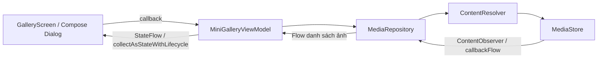

# MiniGallery Compose

Bản Jetpack Compose độc lập của bài thực hành đọc và thêm ảnh Android, lưu tại **D:\MiniGallery**. Bản XML tại D:\AndroidTrainingExample được giữ nguyên. Application ID mới là **com.example.minigallery**, có thể cài hai bản cùng lúc.

## Chức năng

- Đọc ảnh thật trên thiết bị bằng MediaStore/ContentResolver.
- Grid thích ứng chiều rộng, thumbnail tải bằng Coil AsyncImage.
- Tìm theo tên và sắp xếp ngày mới/cũ, tên A–Z/Z–A.
- Xem ảnh lớn, tên, MIME type, dung lượng, ngày thêm và content URI.
- Photo Picker chọn tối đa 10 ảnh; xem trước và lưu bản sao vào Pictures/MiniGallery.
- Hiển thị tiến độ, kết quả mỗi ảnh; chặn lưu trùng batch.
- Xử lý quyền đầy đủ, một phần trên Android 14+ và từ chối; refresh khi onResume.
- Material 3, theme sáng/tối và màu hệ thống trên Android 12+.

Chỉ UI được viết lại. Model, Repository, ViewModel, PermissionHelper và regression test được tái sử dụng từ bản XML, đổi package sang com.example.minigallery.

## Chạy trên Windows

Mở project bằng Android Studio. Project sử dụng AGP 9.1.1, Gradle 9.3.1, Compose compiler plugin 2.3.20, Compose BOM 2026.03.01, JDK 21, minSdk 29, compileSdk 36.1 và targetSdk 36. Kotlin được AGP 9 hỗ trợ trực tiếp; không thêm plugin kotlin-android cũ.

Bản Git không chứa đường dẫn SDK/JDK riêng của máy. Mở thư mục MiniGallery bằng Android Studio để tạo local.properties; chọn Gradle JDK là Android Studio JBR 21. Hoặc cấu hình JAVA_HOME và sdk.dir theo máy đang dùng. Java toolchain yêu cầu JetBrains JDK 21.

```powershell
Set-Location .\MiniGallery
android info
android emulator start Pixel_7_Pro
.\gradlew.bat testDebugUnitTest lintDebug assembleDebug connectedDebugAndroidTest
android run --device emulator-5554 --apks app/build/outputs/apk/debug/app-debug.apk
```

APK: `app/build/outputs/apk/debug/app-debug.apk`. Có thể dùng nút Run của Android Studio hoặc adb install -r nếu không có Android CLI.

## Chuẩn bị dữ liệu và demo

```powershell
.\scripts\Prepare-DemoImages.ps1 -Serial emulator-5554
```

Script tạo/nạp 10 PNG vào Pictures/MiniGalleryDemo và yêu cầu Media Scanner scan. Không xóa ảnh có sẵn; chạy lại chỉ ghi đè đúng các file demo cùng tên. Ảnh mẫu nằm trong docs/demo-images.

1. Cấp quyền đọc thư viện, tìm `demo_`, kiểm tra 10 ảnh nguồn và thử sắp xếp.
2. Mở ảnh xem metadata; URI có thể chọn/copy trong dialog.
3. Bấm Thêm ảnh, chọn 10 ảnh mẫu rồi kiểm tra preview trước khi lưu.
4. Xoay ngang: danh sách cuộn, nút lưu/đóng vẫn ở cuối dialog. Dữ liệu batch nằm trong ViewModel nên giữ qua thay đổi cấu hình.
5. Lưu bản sao, kiểm tra kết quả mỗi ảnh. Sau khi hoàn tất batch, nút lưu vô hiệu; đóng preview và mở picker để bắt đầu batch mới.
6. Mở Files/Gallery vào Pictures/MiniGallery để kiểm tra bản sao; nguồn vẫn còn ở MiniGalleryDemo.
7. Thử cấp quyền một phần, hủy picker, thu hồi quyền từ Settings và quay lại ứng dụng.

Photo Picker trả về URI được cấp quyền, chưa thêm ảnh vào thiết bị. Repository thực hiện thao tác ghi để tạo bản sao. Picker và ghi ảnh do app tạo trên Android 10+ không cần quyền đọc toàn thư viện; grid chính yêu cầu quyền để bắt đầu đọc thư viện.

## Kiến trúc và đối chiếu với bản XML



| Bản XML | Bản Compose |
|---|---|
| AppCompatActivity + setContentView | ComponentActivity + setContent |
| RecyclerView/GridLayoutManager | LazyVerticalGrid/GridCells.Adaptive |
| GalleryAdapter/DiffUtil | items với stable key theo id |
| ImageView + Coil.load | AsyncImage |
| TextInputEditText + listener | OutlinedTextField(value, onValueChange) |
| PopupMenu | DropdownMenu |
| AlertDialog/XML preview | Dialog/Surface/LazyColumn |
| repeatOnLifecycle collect/renderUi | collectAsStateWithLifecycle + recomposition |
| Dismiss Window khi Activity hủy | Dialog được quản lý bởi composition |

GalleryScreen chỉ đọc UiState và gọi callback; không query MediaStore hoặc mở stream trong composable. Detail lưu id bằng rememberSaveable; không giữ Activity hoặc Bitmap. Import state được ViewModel quản lý. Scaffold xử lý system insets; grid có khoảng trống dưới để FAB không che ảnh.

Repository query trên Dispatchers.IO và đóng Cursor bằng use. Khi ghi: insert IS_PENDING=1, copy stream có kiểm tra cancellation, publish bằng IS_PENDING=0; lỗi/cancellation dọn target trong NonCancellable. Không dùng _data, MANAGE_EXTERNAL_STORAGE hoặc chỉnh sửa ảnh nguồn.

## Áp dụng kiến thức đã học

| Kiến thức | Nơi áp dụng |
|---|---|
| Generic | Result<Uri>, StateFlow<MiniGalleryUiState>, generic Factory.create<T> |
| Collections | filter, sortedBy, sortedByDescending, map, take(10) trong ViewModel |
| Coroutines | viewModelScope, suspend, withContext(IO), ensureActive, finally |
| Flow | ContentObserver + callbackFlow/awaitClose, conflate/debounce, StateFlow |
| Activity/lifecycle | Activity Result API, onResume, collectAsStateWithLifecycle |
| Content Provider | MediaStore qua ContentResolver query/insert/update/delete |
| Compose | State hoisting, rememberSaveable, lazy layouts, semantic test tags, Preview |

Không thêm Service, AIDL, BroadcastReceiver, backend, Room hoặc DI framework vì bài tập không cần.

## File nên đọc

- MainActivity.kt: quyền, picker, ViewModel và setContent.
- ui/screen/GalleryScreen.kt: màn hình và state hoisting.
- ui/screen/GalleryDialogs.kt: detail/import dialog.
- ui/MiniGalleryViewModel.kt và MiniGalleryUiState.kt: state và coroutine.
- data/MediaStoreRepositoryImpl.kt: đọc/ghi, observer và cleanup.
- util/PermissionHelper.kt: quyền theo API.
- theme/: Material 3, typography, màu và kích thước chung.

Tất cả nằm trong app/src/main/java/com/example/minigallery. Có @Preview trong GalleryScreen.kt. Không dùng layout XML, RecyclerView, ViewBinding hoặc AndroidView; XML chỉ còn cho manifest, theme khởi động, icon và string resource.

## Kiểm chứng và hạn chế

Xem [biên bản kiểm chứng](docs/verification/RESULTS.md) cho số test, thiết bị, screenshot và kết quả thực tế. UI test kiểm tra denied/picker, search, detail và batch hoàn tất không lưu lại. Unit test bảo vệ logic đã sửa ở bản XML. Instrumentation repository dùng MediaStore thật và chỉ dọn các row test do chính nó tạo.

Thay đổi cấu hình giữ state qua ViewModel, nhưng không có cơ chế phục hồi batch sau process death/force-stop. Cleanup cancellation không bảo đảm chạy nếu process bị kill đột ngột. Ảnh cloud/mất mạng, đầy bộ nhớ và các API chưa có thiết bị cần kiểm tra thêm theo biên bản. Thư viện và album shared storage dùng chung với bản XML, nên ảnh do hai bản tạo có thể xuất hiện cùng nhau khi được cấp quyền đọc.

Tham khảo: [Compose state](https://developer.android.com/develop/ui/compose/state), [Lazy layouts](https://developer.android.com/develop/ui/compose/lists), [MediaStore](https://developer.android.com/training/data-storage/shared/media), [Selected Photos Access](https://developer.android.com/about/versions/14/changes/partial-photo-video-access).
