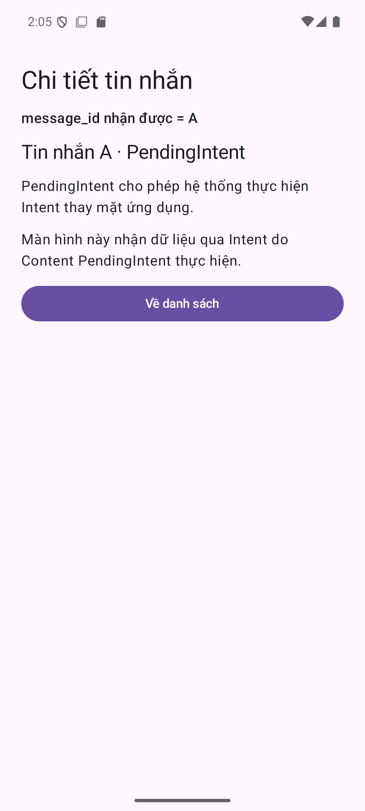

# Kiểm chứng bản Jetpack Compose — Notification Practice

Ngày 05/10/2026 (Asia/Bangkok). Project tại `C:\Users\cuong.bui1\IdeaProjects\NotificationPractice`.

## Thay đổi

- MainActivity và MessageDetailActivity dùng ComponentActivity/setContent.
- PracticeScreens.kt chứa giao diện Compose Material 3, theme light/dark, hai Preview và MainUiState.
- mutableStateOf cập nhật quyền và trạng thái đọc; rememberSaveable giữ công tắc qua Activity recreation.
- Xóa hai layout XML và ViewBinding; manifest, strings/icon/window theme vẫn là Android resources.
- Giữ các luồng token getActivity/getBroadcast, channel, permission và chế độ lỗi dùng chung Content PendingIntent.
- Tests chuyển từ Espresso View assertions sang Compose semantics/testTag.

## Build và lint

```powershell
.\scripts\Check-Project.ps1 -ConnectedTests -Serial emulator-5554
```

Kết quả bản Compose: **BUILD SUCCESSFUL**, assembleDebug đạt, lintDebug đạt (**0 errors, 6 warnings**). Warnings về target/dependency versions và backup; không có lỗi build/lint. SDK tools có cảnh báo schema XML nhưng build thành công.

Dependencies dùng Kotlin/Compose compiler 2.2.10 và BOM 2026.03.01, tương thích với cấu hình AGP 9.1.1 và compileSdk 36.1 của project. Không nâng toàn bộ toolchain trong lần đổi UI này.

APK: `app/build/outputs/apk/debug/app-debug.apk`.
Báo cáo lint: `app/build/reports/lint-results-debug.html`.

## Compose instrumentation tests: 4/4 đạt

Thiết bị: Pixel_6, emulator-5554, Android 15 / API 35. App targetSdk 36.

| Test | Kiểm tra |
|---|---|
| separateRequestCodes_keepOriginalMessage_andHandleNewIntent | Token A/B khác nhau, mở đúng A/B và recompose sau onNewIntent |
| sharedRequestCode_updatesOldTokensExtras_evenWhenImmutable | Cùng token, gửi A cũ sau tạo B nhận B |
| broadcastAction_marksOnlyItsMessageRead_andRecomposesResumedScreen | Chỉ A đã đọc; Compose cập nhật dù Main vẫn resumed; B chưa đọc |
| brokenMode_survivesActivityRecreation | Công tắc còn bật sau ActivityScenario.recreate(), chứng minh rememberSaveable |

XML bản cuối ghi tests=4, failures=0, errors=0, skipped=0. Kết quả ở `app/build/outputs/androidTest-results/connected/debug/TEST-Pixel_6(AVD) - 15-_app-.xml`.

## Chạy thực tế bằng Android CLI

Cài/mở APK qua `android run`, đọc UI bằng `android layout`; thao tác ADB theo tọa độ vừa đọc.

- Cấp POST_NOTIFICATIONS từ nút của giao diện Compose: trạng thái đổi sang đã bật.
- Bấm Tạo thông báo A, nhấn Home, mở bảng notification: notification A xuất hiện cùng action đã đọc.
- Chạm notification A: mở Compose Detail và nhận đúng ID A; setAutoCancel hủy notification.
- Ảnh bên dưới được xem trực tiếp: chữ tiếng Việt đúng, nội dung và nút không bị system bars che.



Log của bản Compose: [runtime-compose-api35.log](runtime-compose-api35.log).

## Phạm vi

Bản Compose kiểm chứng runtime trên API 35. Chưa chạy bản Compose riêng trên API 29–34, 36/37, thiết bị thật, mọi tổ hợp khóa màn hình/thu hồi permission/channel tắt, hoặc cỡ chữ lớn. Bảng nghiệm thu trong hướng dẫn dành cho người học tự điền; không coi những dòng chưa chạy là đã kiểm chứng.

Bài dùng getActivity để luyện hai nội dung chính; không tự dựng parent back stack. Nút Về danh sách mở Main khi cần. TaskStackBuilder là phần mở rộng.

Ảnh read-action.png và log runtime-api35.log cũ là bằng chứng của bản XML trước khi chuyển; bằng chứng hiện tại là ảnh/log Compose và 4 Compose tests ở trên.